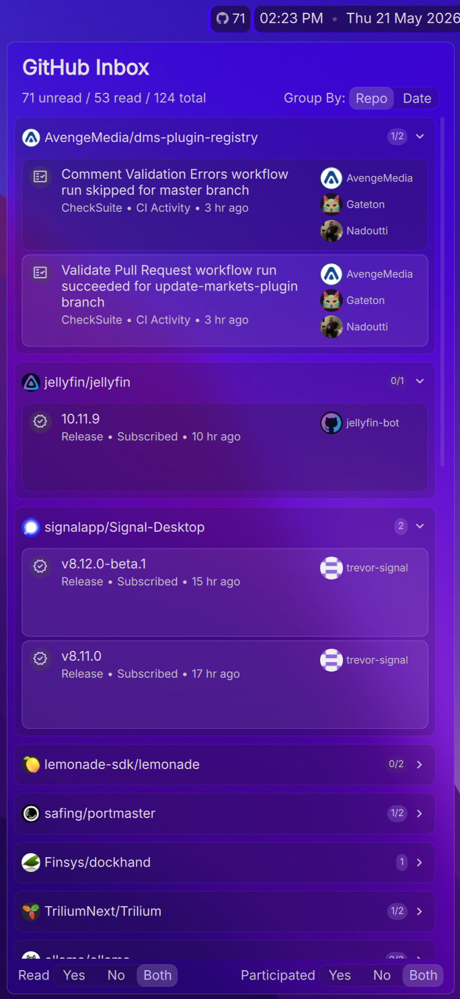
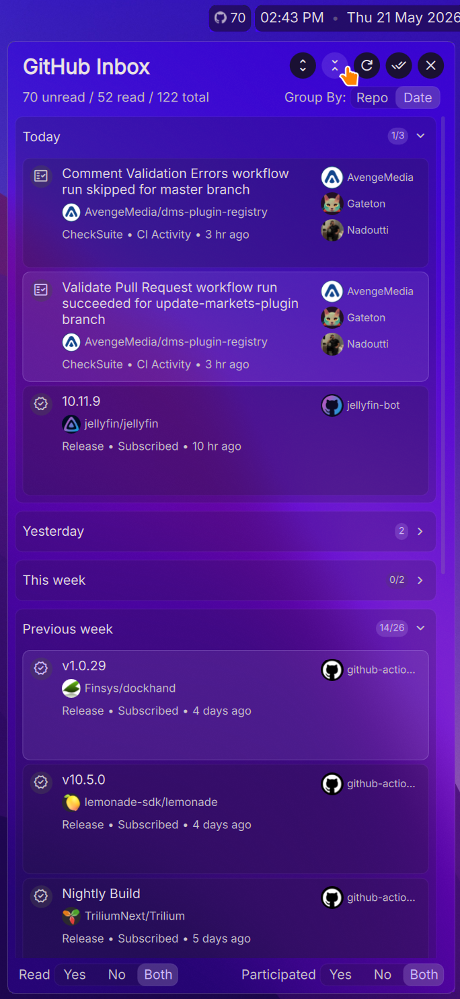
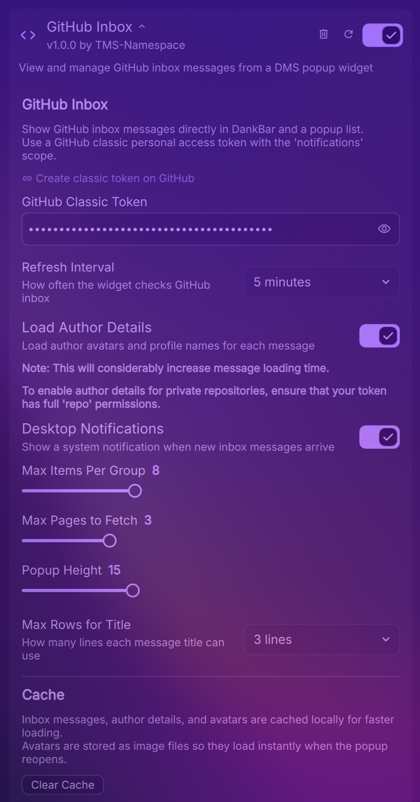

# GitHub Inbox Plugin for DMS

A [DankMaterialShell](https://github.com/AvengeMedia/DankMaterialShell) widget plugin that shows your `GitHub` notifications (or the so called `Inbox`) in a popup and lets you mark them as read or done.

<div align="center">

| Group by repo | Group by date |
|:---:|:---:|
|  |  |

</div>

## Features

- `DankBar` widget with unread count.
- Popup inbox grouped by repository or date with expandable sections.
- Open a thread source, repository page, or author's page directly in your browser.
- Mark a single thread, a group of threads, or all threads as read/done.
- Configurable refresh interval and fetch size.
- Configurable popup item limit and title line count.
- Show a `DMS` notification for new incoming threads.
- Filter options:
  - Show read, unread, or all threads.
  - Show threads you participated in, did not participate in, or all threads.

<div align="center">

| Settings |
|:---:|
|  |

</div>

## Authentication

This plugin uses a **GitHub classic personal access token**, which can be created on <https://github.com/settings/tokens>.

*Recommended token scope*:

- `notifications`
- To show full details for threads from private repositories, also enable the full `repo` permission for this token.

## Requirements

- `DMS` >= `1.2.0``
- `curl` in `$PATH` (usually pre-installed on most distros).
- `secret-tool` in `$PATH` (usually pre-installed with `libsecret` on most distros).
- To show authors, the `jq` command-line tool is needed to parse `JSON` (usually needs a manual install).
- Internet access to `api.github.com``

## Limitations

- The `GitHub` notifications API exposes only whether a message is `Read`/`Unread`, but it does not expose a `Done` state.

  Because of that, this plugin maintains and caches `Done` state locally for actions performed inside the plugin.

  If you mark a notification as `Done` in the GitHub web UI, the API can still return it as a `Read` thread. In that case the plugin cannot reliably detect that it was marked `Done`, so it may remain visible as `Read`.

- Notifications from `Dependabots` are supported, since `Github` does not provide a well generalizable  way to fetch them.

## Install

### Method 1

In DMS:

1. Open `Settings -> Plugins`
2. Click `Scan for Plugins`
3. Enable `GitHub Inbox`
4. Add widget to DankBar

### Method 2

Or clone repo, and run (will add `Symlink` to plugin folder):

```bash
chmod +x Support/setup-symlink.sh
Support/setup-symlink.sh
```

## Privacy & Security

- The token is securely stored via `Freedesktop Secret Service` API.
- The plugin sends web requests only to GitHub endpoints, so privacy is limited by what GitHub offers.

## Disclaimers

- The developer has no affiliation with data provider.
- This plugin was vibe-coded under my supervision as a software engineer.
