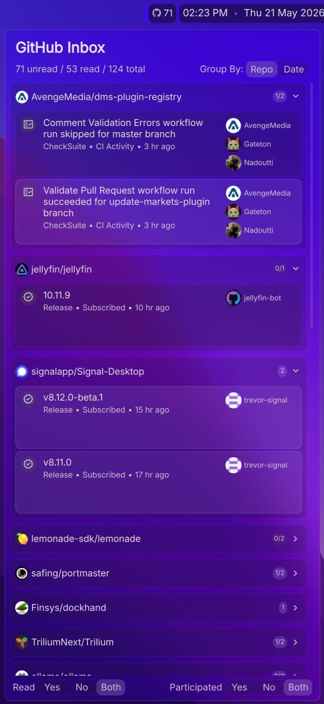
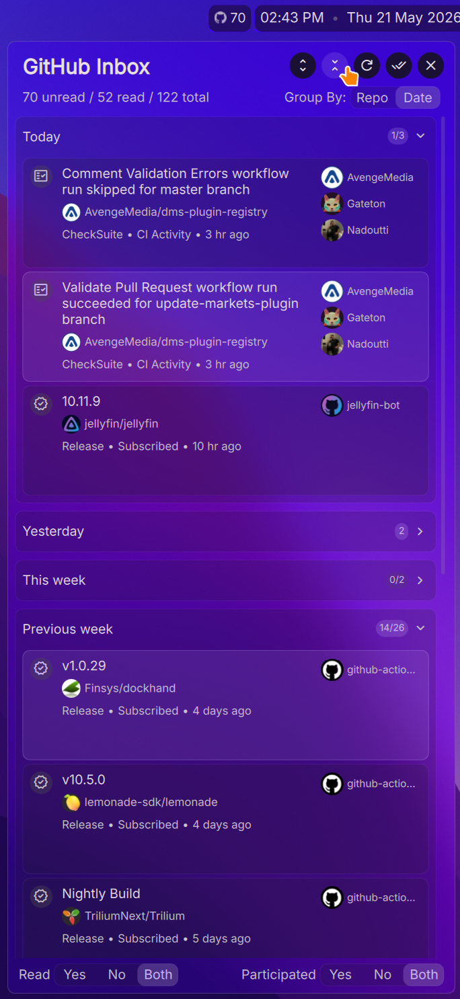
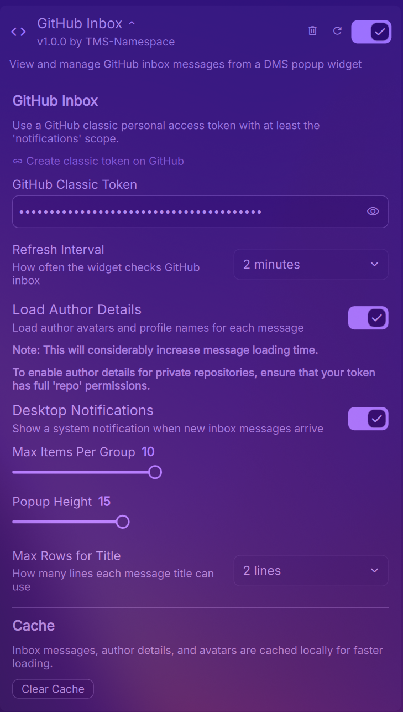

# GitHub Inbox Plugin for DMS

A [DankMaterialShell](https://github.com/AvengeMedia/DankMaterialShell) widget plugin that shows your `GitHub` notifications (or the so called `Inbox`) in a popup and lets you mark them as read or done.

<div align="center">

| Group by repo | Group by date |
|:---:|:---:|
|  |  |

</div>

## Features

- `DankBar` widget with unread count of Github Inbox messages.
- Popup inbox grouped by repository or date with expandable sections.
- Open a thread source, repository page, or author's page directly in your browser.
- Mark a single thread, a group of threads, or all threads as read/done.
- Configurable refresh interval.
- Configurable popup item limit and title line count.
- Show a `DMS` notification for new incoming threads.
- Filter options:
  - Show read, unread, or all threads.
  - Show threads you participated in, did not participate in, or all threads.

<div align="center">

| Settings |
|:---:|
|  |

</div>

## Authentication

This plugin uses a **GitHub classic personal access token**, which can be created on <https://github.com/settings/tokens>.

*Recommended token scope*:

- `notifications`
- To show full details for threads from private repositories, also enable the full `repo` permission for this token.

## Requirements

- DMS >= 1.2.0.
- Required commands in `$PATH`: `bash`, `curl`, `jq`, `secret-tool` (libsecret), `notify-send` (libnotify), and `file`.
- Unlocked Freedesktop Secret Service keyring to store the token.
- Internet access to GitHub's API and avatar hosts.

## Limitations

- Currently, Github notifications API does not return a separate `Done` flag. The plugin caches done status of messages locally, and infers that a currently visible thread was marked done on GitHub when it disappears from the returned by API results. This is a best-effort workaround.
- Some GitHub inbox messages, including organization security alerts, and `Dependabots`, will be missed, since `GitHub` does not provide a well generalizable way to fetch them.

## Install

### Method 1

In DMS:

1. Open `Settings -> Plugins`
2. Click `Scan for Plugins`
3. Enable `GitHub Inbox`
4. Add widget to DankBar

### Method 2

Or clone repo, and run (this will add `Symlink` to plugin folder):

```bash
chmod +x Support/setup-symlink.sh
Support/setup-symlink.sh
```

## Privacy & Security

- Contacts `api.github.com` for inbox and author data, `avatars.githubusercontent.com` for user avatars, and `github.com` for app avatars and the GitHub icon.
- Opening a thread, repository, author, or token-settings link launches the system browser.
- Writes cache files under `~/.cache/dms-github-inbox-plugin`, and fallback to `/tmp/dms-github-inbox-plugin` if the normal cache path cannot be resolved. The cache includes notification, authors metadata, downloaded avatars.
- Stores the GitHub token through `Freedesktop Secret Service` via `secret-tool`. Authenticated requests send the token to `curl` over stdin.

## Disclaimers

- The developer has no affiliation with data provider.
- This plugin was vibe-coded under my supervision as a software engineer.
